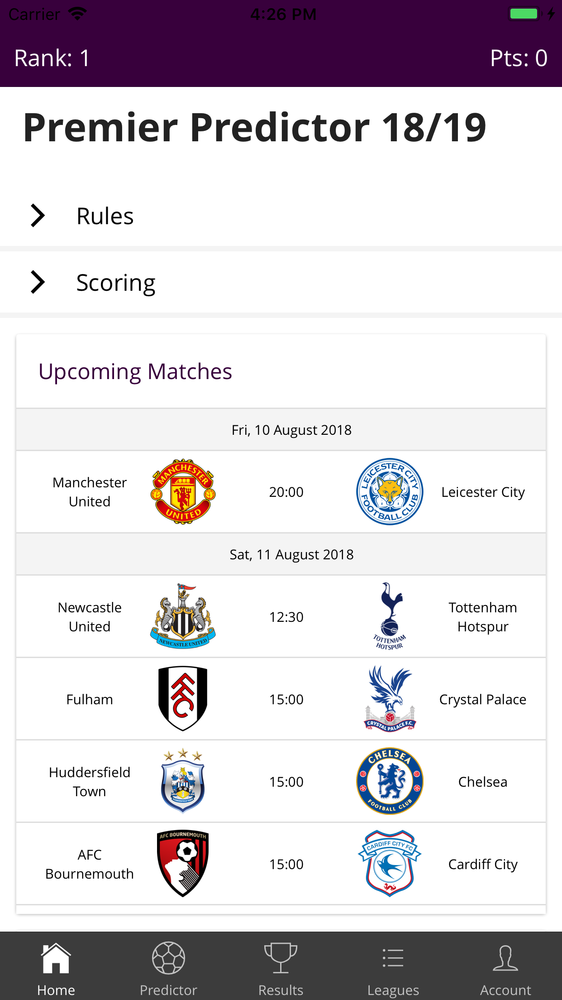
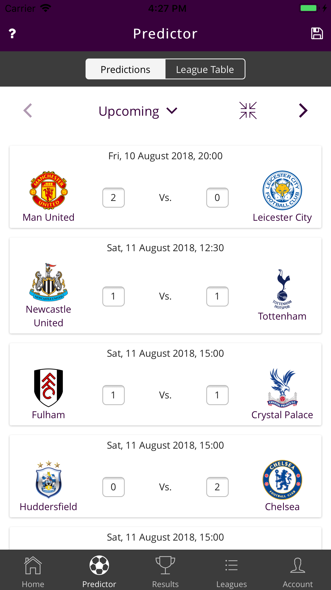
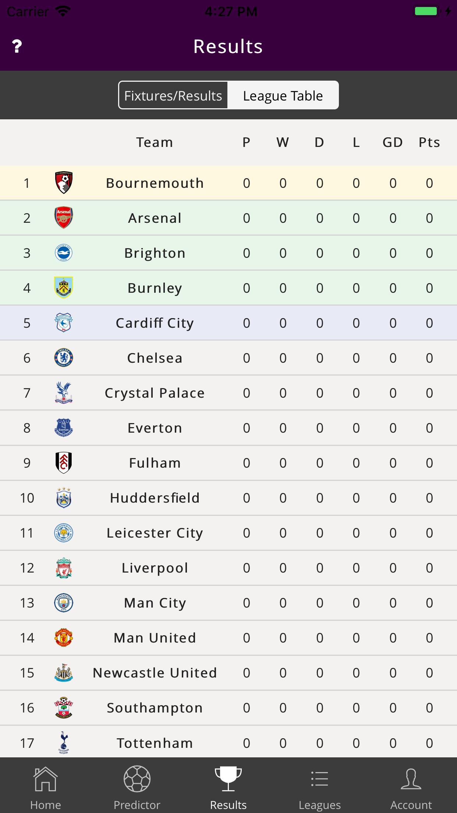
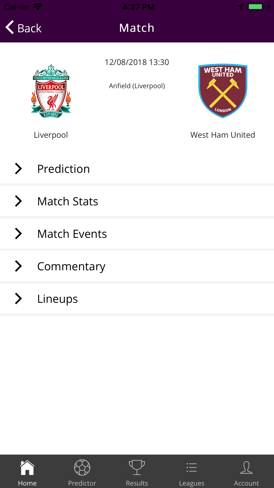
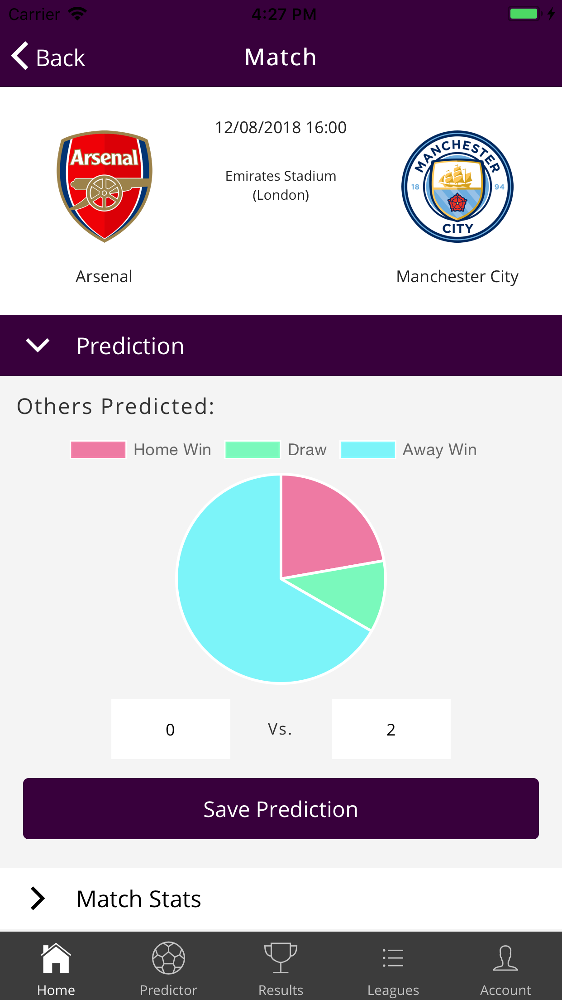
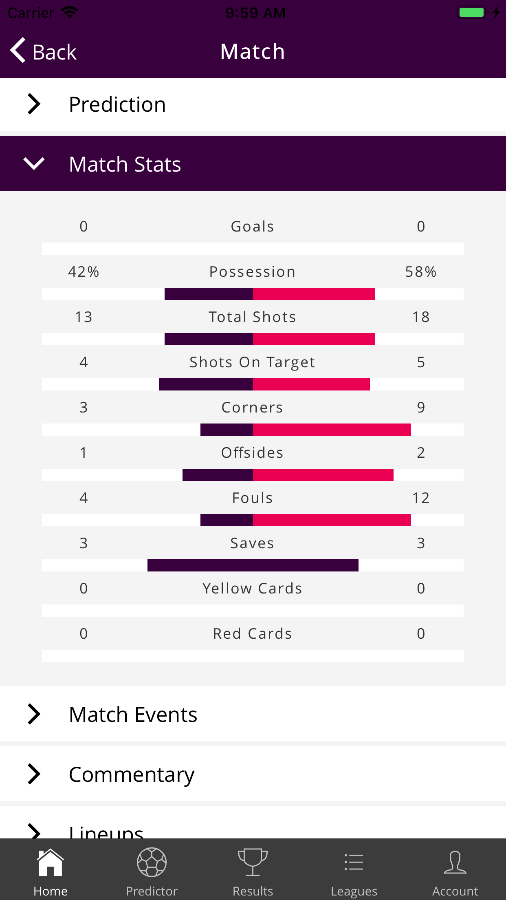
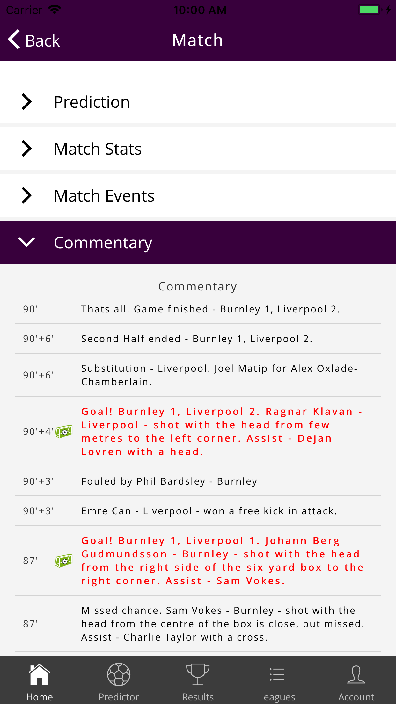
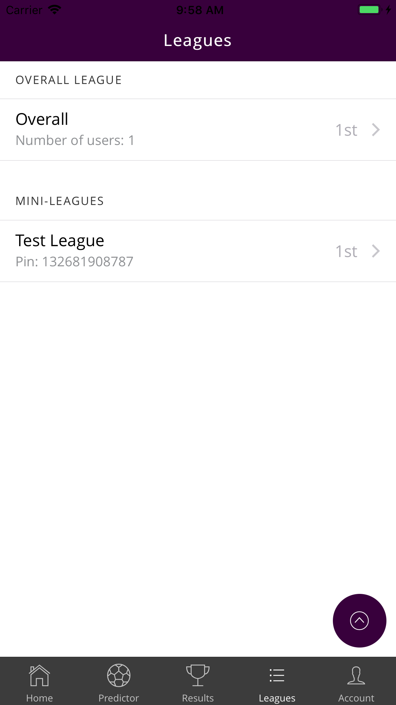
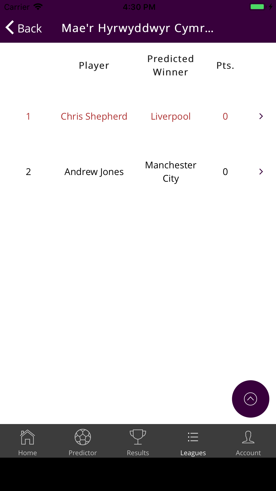
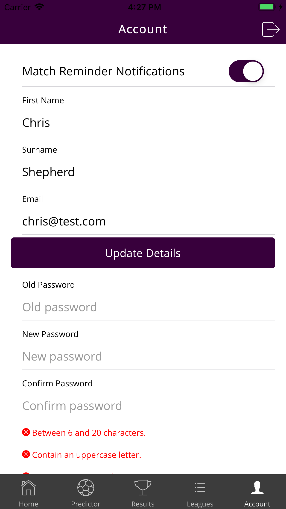

# Premier Predictor 18/19

## Table of Contents
1. [Introduction](#introduction)
2. [Technical Details](#technical-details)
3. [Functions](#functions)
4. [Screenshots](#screenshots)
5. [Key Features](#key-features)
6. [Rules](#rules)
7. [Scoring](#scoring)
8. [App Store Presence](#app-store-presence)

## Introduction

Premier League 18/19 predictor app, designed for users to correctly predict all the scores for the 18/19 Premier League to score points, as well as creating mini-leagues to compete with friends. Users can also check live match scores and stats.

## Technical Details

- This is built using the Ionic framework, with back-end APIs written in Kotlin using Spring Boot.
- The back-end is fully unit tested using TDD and is currently being hosted on Heroku.
- The database used to store user data and match results is using PostgreSQL
- A noSQL DynamoDB database is used to store the live match stat data.
- Websockets are used to send the live match data automatically to the user's device when the match is in-play.
- Scheduled AWS Lambda functions are used to automatically check if games are in-play and to retrieve the live data.
- A scheduled AWS Lambda function is also used to automatically call an API to update match results, as well as user scores.
- All match data is retrieved from an external API, the results are then used to compare against each user's predictions to assign points.

## Functions

#### Fixture Update

- **Language** - JavaScript, Node.js
- **Event** - Scheduled - 3:00am GMT every day (currently disabled)
- **Description** - Calls the fixture update API. This will update information about each match to make sure they are up to date, for example if the match has been rescheduled.
- **Services** - AWS Lambda, Serverless

#### Match Data Refresh

- **Language** - Kotlin, Spring Boot
- **Event** - Scheduled - 3:00am GMT every day
- **Description** - Makes an API call to retrieve all latest match data. This will update information about each match to make sure they are up to date, for example if the match has been rescheduled.
- **Services** - AWS Lambda, Serverless, DynamoDB, PostgreSQL, SendGrid

#### Match Update

- **Language** - Kotlin, Spring Boot
- **Event** - Scheduled - every minute
- **Description** - Checks Redis to see which matches are playing, then will update each match with the latest live data. If a match finishes it will store the result and update user scores if all matches that day have finished.
- **Services** - AWS Lambda, Serverless, Redis, DynamoDB, PostgreSQL, SendGrid

#### Live Match Check

- **Language** - Golang
- **Event** - Scheduled - every five minutes
- **Description** - Makes an API call to see which matches are currently playing, will then store the corresponding matchIds in Redis
- **Services** - AWS Lambda, Serverless, Redis

#### Score Update

- **Language** - Golang
- **Event** - Scheduled - 10:15pm GMT every day
- **Description** - Checks to see if the user scores have been updated that day, if there have been matches. If not, it will make an API call to update the scores and send an email notification.
- **Services** - AWS Lambda, Serverless, Redis, SendGrid

#### Get Live Matches

- **Language** - Golang
- **Event** - `GET https://jbemuyb0o3.execute-api.us-east-1.amazonaws.com/dev/live`
- **Description** - Will retrieve the currently live matches from Redis, used for development purposes
- **Services** - AWS Lambda, Serverless, Redis

## Screenshots

          

## Key Features

- Enter/edit predictions for every match
- Up to date live scores for each match
- Up to date live match stats and commentary
- Check fixtures/results and league table
- Check league table and results based on your predictions
- Create and join mini-leagues to compete against your friends
- View your overall standing against all other users

## Rules

- Predictions for each match can be added/updated any time before the match kicks off.
- Predictions can be changed as often as you wish.
- Once a match kicks off, the prediction for that game will be locked in and cannot be changed.
- User scores will be updated within 24 hours of the full time whistle.

## Scoring

- **1 Pt.** - Correct amount of goals for a team. (e.g. prediction of 2-1, final score is 2-3, 1 point will be awarded. Prediction of 3-1, final score is 2-2, 0 points will be awarded.)
- **3 Pts.** - Correct result, plus points for correct amount of goals (if any). (e.g. prediction of 2-1, final score is 3-2, 3 points will be awarded for predicting the correct team to win.)
- **3 Pts.** - Correct scoreline, plus points for a correct result and goals. (e.g. prediction of 2-1, final score is 2-1, 8 points will be awarded - 3 for correct scoreline, 3 for correct result, 1 for each team's correct amount of goals)
- **5 Pts.** - Each correct team finishing position in the league (based on your predictions).
- **20 Pts.** - The predicted winner chosen at sign-up finish as champions.

## App Store Presence

Google Play Store link:
https://play.google.com/store/apps/details?id=com.cshep4.premierpredictor

Apple App Store link:
https://itunes.apple.com/us/app/premier-predictor-18-19/id1418486863?ls=1&mt=8
